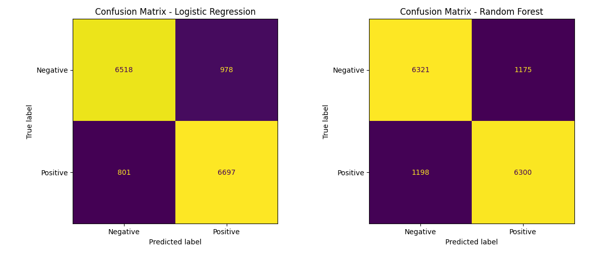
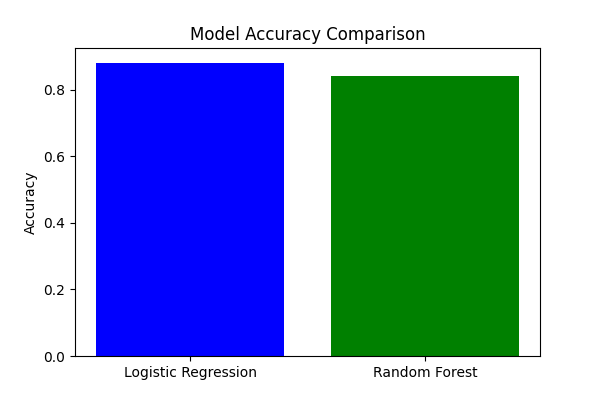

# IMDB Movie Reviews Sentiment Analysis

A machine learning project that analyzes IMDB movie reviews to classify sentiment as positive or negative using multiple classification algorithms.

## Project Overview

This project implements and compares three different machine learning models for sentiment analysis on IMDB movie reviews:
- Logistic Regression
- Random Forest
- Linear SVM

The models are trained on preprocessed text data using TF-IDF vectorization and evaluated using various metrics including accuracy, precision, and confusion matrices.

## Project Structure

```
imdb-sentiment-analysis/
├── data_processed/
│   ├── tfidf_vectorizer.pkl
│   └── processed_data.pkl
├── models/
│   ├── logistic_regression_model.pkl
│   ├── random_forest_model.pkl
│   └── linear_svm_model.pkl
├── output/
│   └── performance_comparison.csv
├── src/
│   ├── data_preprocessing.py
│   ├── model_training.py
│   ├── model_evaluation.py
│   └── hyperparameter_tuning.py
├── results/
│   ├── confusion_matrix_logistic.png
│   ├── confusion_matrix_random_forest.png
│   └── accuracy_comparison.png
├── requirements.txt
├── README.md
└── main.py
```

## Model Performance

### Accuracy Results
- **Logistic Regression**: 88.14%
- **Random Forest**: 84.17%
- **Linear SVM**: 86.05%

### Precision Results
- **Logistic Regression**: 87.26%
- **Random Forest**: 84.28%
- **Linear SVM**: 86.00%

## Confusion Matrix Analysis

### Logistic Regression Results


The logistic regression model achieved the best performance with:
- True Negatives: 6,518
- False Positives: 978
- False Negatives: 801
- True Positives: 6,697

### Random Forest Results  
![Confusion Matrix - Random Forest]

The random forest model showed:
- True Negatives: 6,321
- False Positives: 1,175
- False Negatives: 1,198
- True Positives: 6,300

### Model Comparison


Logistic Regression demonstrated superior performance compared to Random Forest and Linear SVM across all evaluation metrics.

## Hyperparameter Tuning

The project implements comprehensive hyperparameter optimization:

### Random Forest
- **Best Parameters**: max_depth: None, min_samples_split: 2, n_estimators: 200
- **Grid Search**: 3-fold cross-validation across 24 parameter combinations (72 total fits)

### Linear SVM  
- **Best Parameters**: C: 0.1
- **Grid Search**: 3-fold cross-validation across 5 parameter combinations (15 total fits)

### Logistic Regression
- Optimized using GridSearchCV with multiple regularization parameters
- 3-fold cross-validation for robust parameter selection

## Technical Implementation

### Data Processing
- Text preprocessing and cleaning
- TF-IDF vectorization for feature extraction
- Train-test split for model evaluation

### Model Training
- Scikit-learn implementation of all models
- Joblib for model persistence and loading
- Cross-validation for hyperparameter optimization

### Evaluation Metrics
- Accuracy and precision calculation
- Confusion matrix visualization
- Performance comparison across models

## Dependencies

```
scikit-learn>=1.0.0
pandas>=1.3.0
numpy>=1.21.0
matplotlib>=3.4.0
seaborn>=0.11.0
joblib>=1.0.0
```

## Usage

1. Install required dependencies:
```bash
pip install -r requirements.txt
```

2. Run the complete analysis pipeline:
```bash
python main.py
```

3. View results in the `output/` directory and generated visualizations in `results/`

## Results Summary

The analysis demonstrates that Logistic Regression provides the most effective approach for IMDB sentiment classification, achieving 88.14% accuracy. The comprehensive evaluation includes confusion matrices and precision metrics, providing insights into model performance across different classification scenarios.

All model artifacts and evaluation results are saved for reproducibility and further analysis.
